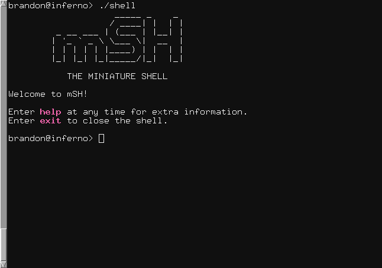

# msh - A Unix Shell

msh is a small shell for use on Unix and Unix-like systems. It has been
tested on GNU/Linux (Debian) and FreeBSD.

msh currently does not require any special requirements. It can be
built with only the gcc compiler and GNU make.

On BSD systems, there is currently an issue with getting the shell
compiled with gcc. If this occurs, the shell can be compiled using
the Clang compiler.

msh currently supports command input, I/O redirection, and pipelining.

Future improvements may include:

* Command history
* Scripting support
* Network pipes

## Building

To build the code on Linux-based systems, just run

`make`

This will generate an executable named `shell`.

**Note:** If you are not using the gcc compiler, or are on a BSD-based
system, you can compile msh using the following command:

`clang src/*.c -I . -o shell`